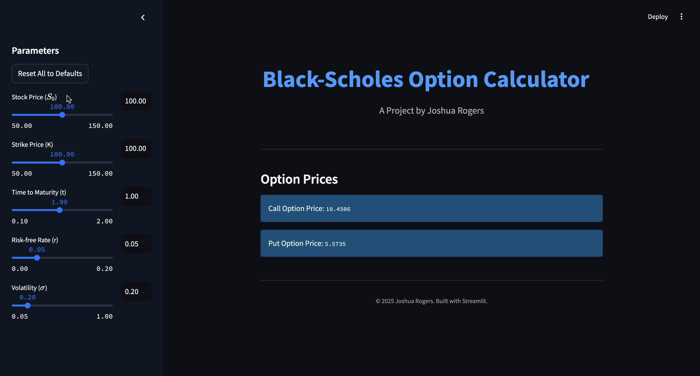

# Black-Scholes Calculator

A Streamlit-based Black-Scholes option pricing calculator with synced inputs, reset functionality, and future plans for 3D visualisation. Built to practice Python, Streamlit, and financial concepts.

## Demo GIF


## Live Demo
[Open the Calculator on Streamlit Cloud](https://black-scholes-calculator-jr.streamlit.app)  
*(No setup needed)*

## Overview
This Black-Scholes Option Calculator is a personal project built using Python and Streamlit, designed as a practical way for me to deepen my understanding of both programming and financial mathematics. It calculates theoretical prices for European call and put options based on the Black-Scholes model, and features a clean, interactive interface with synced sliders and input.

I am currently developing my skills with the goal of working in a role which combines strong quantative analysis with financial expertise, and this project is part of a broader effort to strengthen my technical and analytical skills. While the tool is available for anyone to use and explore, it primarily serves as a demonstration of my progress and approach to building professional-grade applications.

## Run Locally (Optional)
```bash
git clone https://github.com/JoshuaRogers598/black-scholes-calculator.git
cd black-scholes-calculator
pip install -r requirements.txt
streamlit run black_scholes_model.py
```

## Contact

**Joshua Rogers**

Feel free to reach out for collaboration, job opportunities, or any questions regarding this project.

- **Email:** [joshuarogers598@gmail.com](mailto:joshuarogers598@gmail.com)
- **Phone:** +44 7534 548471
- **LinkedIn:** [Joshua Rogers](https://www.linkedin.com/in/joshuarogers598/)

